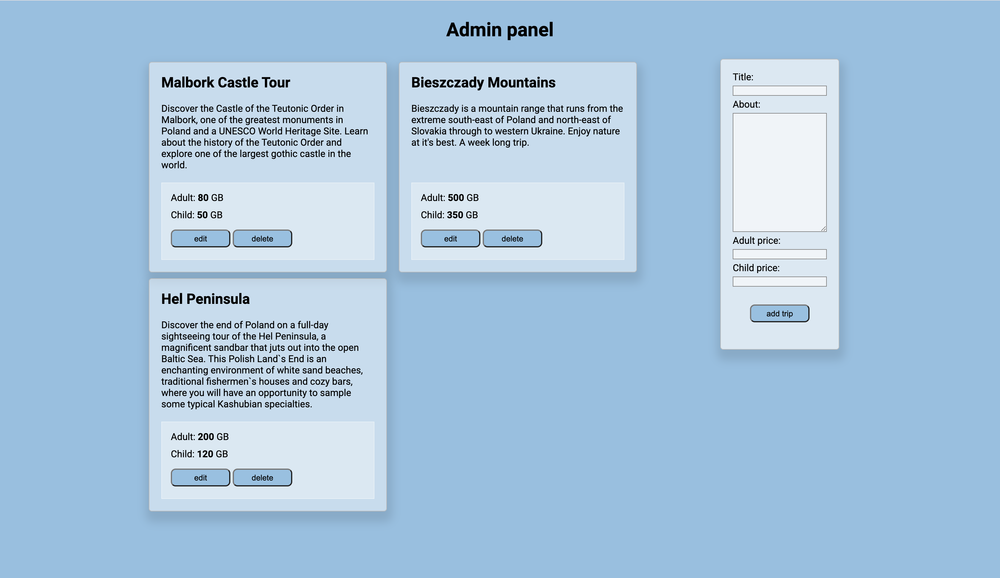
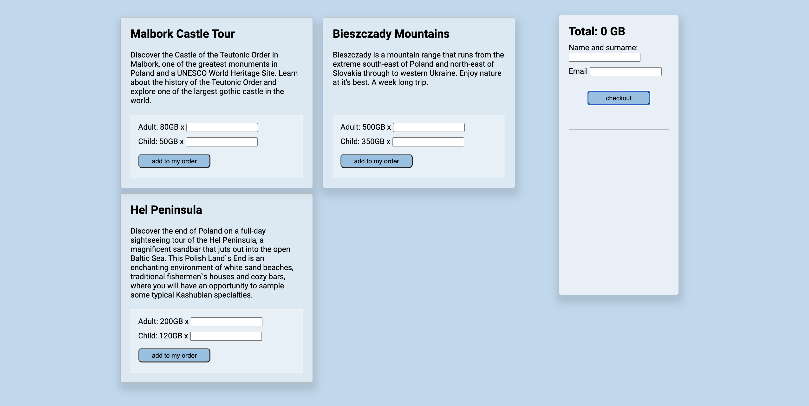

# devmentor.pl - Javascript: Fetch and API

## Table of contents

-   [Overview](#overview)
    -   [The challenge](#the-challenge)
    -   [Screenshot](#screenshot)
    -   [How to run project](#how-to-run-project)
-   [My process](#my-process)
    -   [Built with](#built-with)
-   [Author](#author)
-   [Acknowledgments](#acknowledgments)

## Overview

### The challenge

Users should be able to:

-   To build client and admin panel using API,
-   Client panel should have following functionalities:
    -   client can chose a trip by adding amount tickets in correct form field and adding it to basket,
    -   trip is added to the basket (API basket) and displayed to UI,
    -   the total for the basket is updated every time a trip is added or removed, - client can order trips by filling form field with his/her name, surname and e-mail address and by clicking button "add to order", - order with details is added to API (orders), - all data needs to be validated before sending.
-   Admin panel should have following functionalities:
    -   adding, removing or editing trip from admin panel.

### Screenshot

### How to open project

1. Clone git repository and open file on your local device in Code editor.
2. Run npm install command to install all npm packages.
3. Run npm start command to open developers mode.
4. Run json-server --watch ./data/excursions.json command.

-   Client panel: http://localhost:8080/index.html
-   Admin panel: http://localhost:8080/admin.html

-   Excursions data: http://localost:3000/excursions
-   Basket data: http://localost:3000/basket
-   Orders data: http://localost:3000/orders

## My process

### Built with

-   Semantic HTML5 markup
-   CSS custom properties
-   Webpack
-   Javascript
-   JS modules
-   rest API
-   JSON server

## Author

-   Github - [Axseinga](https://github.com/axseinga)
-   Frontend Mentor - [@Axseinga](https://www.frontendmentor.io/profile/axseinga)
-   LinkedIn - [@Agnieszka Urbanowicz](https://www.linkedin.com/in/agnieszka-urbanowicz-051147151/)

## Acknowledgments

Thanks to my [Mentor - devmentor.pl](https://devmentor.pl/) - for providing me with this task and for code review.
